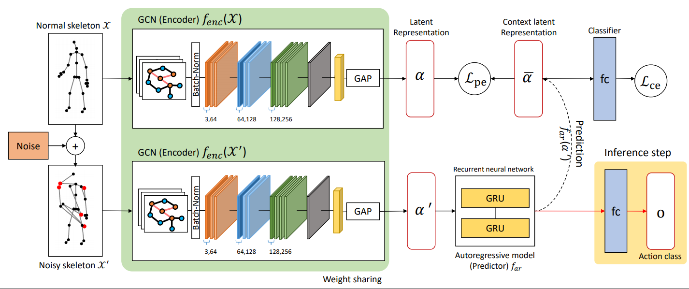

# Predictively Encoded Graph Convolutional Network
Official project for 'Predictively Encoded Graph Convolutional Network for Noise-Robust Skeleton-based Action Recognition'
(Implemented with Py36 and Pytorch)

* The paper is under the review.

If you use this source code, please cite the paper as follows. 
~~~
@misc{yu2020predictively,
    title={Predictively Encoded Graph Convolutional Network for Noise-Robust Skeleton-based Action Recognition},
    author={Jongmin Yu and Yongsang Yoon and Moongu Jeon},
    year={2020},
    eprint={2003.07514},
    archivePrefix={arXiv},
    primaryClass={cs.CV}
}
~~~

## Abstract.
In skeleton-based action recognition, graph convolutional networks (GCNs), which model human body
skeletons using graphical components such as nodes and connections, have achieved remarkable performance recently. However, current state-of-the-art methods for skeleton-based action recognition usually work on the assumption that the completely observed skeletons will be provided. This may be problematic to apply this assumption in real scenarios since there is always a possibility that captured skeletons are incomplete or noisy. In this work, we propose a skeleton-based action recognition method which is robust to noise information of given skeleton features. The key insight of our approach is to train a model by maximizing the mutual information between normal and noisy skeletons using a predictive coding manner. We have conducted comprehensive experiments about skeleton-based action recognition with defected skeletons using NTU-RGB+D and Kinetics-Skeleton datasets. The experimental results demonstrate that our approach achieves outstanding performance when skeleton samples are noised compared with existing state-of-the-art methods.

## File configuration
. 
├── abla.py 
├── arun.sh 
├── config 
│   ├── config.txt 
│   ├── kinetics-skeleton 
│   │   ├── test_bone.yaml 
│   │   ├── test_joint_mutual_none.yaml 
│   │   ├── test_joint_mutual_tmp.yaml 
│   │   ├── test_joint_mutual.yaml 
│   │   ├── test_joint.yaml 
...

## How to train
~~~
python main2.py --config ./config/kinetics-skeleton/train_joint_mutual.yaml
~~~

## How to monitoring
~~~
tensorboard --logdir=./wordir
~~~
